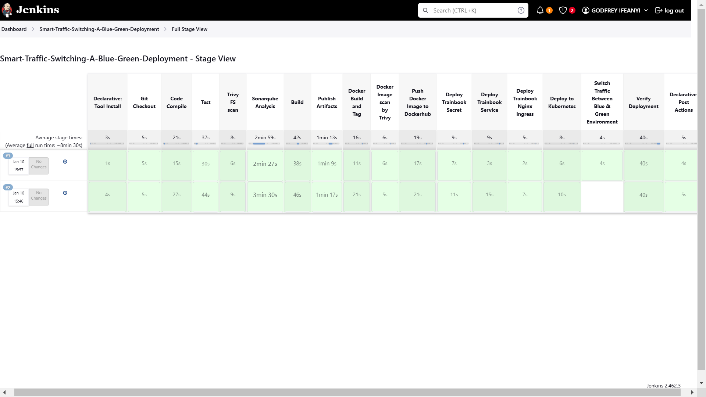
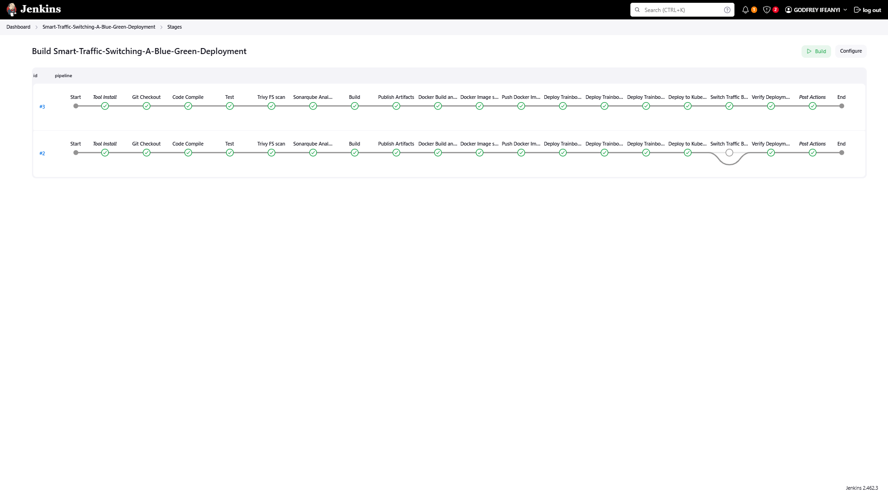
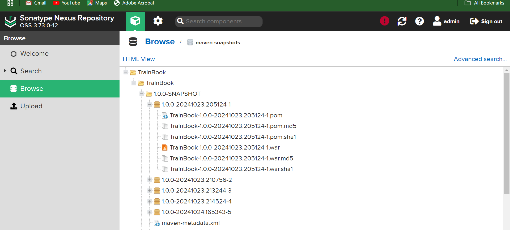

# Smart Traffic Switching: A Blue-Green Deployment Solution Using CI/CD Automation

## Table of Contents
1. [Overview](#overview)
2. [CI/CD Pipeline Features](#cicd-pipeline-features)
3. [Prerequisites](#prerequisites)
4. [Technologies Used](#technologies-used)
5. [Infrastructure Setup](#infrastructure-setup)
   - [AWS EC2 Instance for Jenkins, SonarQube, and Nexus](#ci--aws-ec2-instance-for-jenkins--sonarQube--and-nexus)
   - [EKS Cluster Setup](#cd--eks-cluster-setup)
   - [Service Account & Secrets for Jenkins](#service-account--secrets-for-jenkins)
6. [Pipeline Details](#pipeline-details)
7. [How to Use](#how-to-use)
8. [Troubleshooting](#troubleshooting)
9. [Contributing](#contributing)

## Overview

### Project Application Overview
The project application **Train Ticket Reservation System** is a web-based application designed to simplify the process of booking train tickets and gathering information related to train schedules, seat availability, and fare inquiries. The application allows users to register, view available trains, check seat availability, book tickets, and view booking history. Additionally, the application offers an admin interface for managing train schedules, updating train information, and handling reservations.

### Application Key Features:
- Train schedules and availability viewing.
- Secure seat booking.
- Admin management of train schedules.
- Login, logout, and profile management.
---

### Project Overview

This project implements a highly automated CI/CD pipeline using the Blue-Green deployment strategy to achieve zero-downtime deployments. The Jenkins pipeline is designed to handle every aspect of application delivery, from code integration to traffic switching, ensuring smooth and secure rollouts. Below is a detailed overview of how the pipeline ensures Smart Traffic Switching between the **Blue** and **Green** environments, along with its standout features.

#### Key Highlights:
- **Dynamic Environment Selection**: The pipeline allows users to choose the target deployment environment (Blue or Green) dynamically through parameters.
- **Traffic Switching Automation**: After successful deployment, the pipeline can switch traffic between Blue and Green environments seamlessly with no service interruptions.
- **Integrated Security Scanning**: Ensures the security of the filesystem and Docker images by incorporating Trivy scanning tools at various stages.
- **Complete Artifact Management**: All build artifacts are stored and version-controlled in Nexus, ensuring traceability and easy rollback if needed.
- **Flexible Deployment Configurations**: Kubernetes manifests are dynamically applied based on the chosen environment, minimizing manual intervention.

#### Jenkins Pipeline Stages:
1. **Git Checkout**: Fetches the latest code from the main branch of the GitHub repository.
2. **Code Compile and Test**: Compiles the Java application with Maven and runs unit tests to verify functionality.
3. **Filesystem Security Scan**: Performs filesystem vulnerability scans using Trivy to detect potential risks.
4. **SonarQube Code Analysis**: Evaluates the codebase for maintainability, reliability, and security issues.
5. **Build and Publish Artifacts**: Packages the application and uploads the artifacts to Nexus for centralized storage.
6. **Docker Image Management**: Builds Docker images tagged with environment-specific identifiers **(Blue or Green)** and pushes them to DockerHub.
7. **Docker Image Security Scan**: Scans Docker images for vulnerabilities to maintain secure deployments.
8. **Secrets and Configuration Management**: Deploys sensitive information securely using Kubernetes secrets.
9. **Service and Ingress Deployment**: Deploys Kubernetes services and ingress configurations to expose the application to users.
10. **Blue-Green Deployment**: Dynamically deploys the application to the specified environment **(Blue or Green)**.
11. **Traffic Switching**: Automates traffic routing between Blue and Green environments based on user parameters, enabling seamless user experience during updates.
12. **Deployment Verification**: Confirms that the application is running correctly by checking pods, services, and ingress configurations in the selected environment.
13. **Email Notifications**: Sends detailed email updates about the pipeline status, including deployment details and environment-specific configurations.

#### Unique Features:
- **Parameter-Driven Flexibility**: Users can specify the deployment environment, Docker image tags, and whether to switch traffic—all from the Jenkins UI.
- **Comprehensive Security Assurance**: Trivy scans at multiple levels ensure that only secure artifacts and images are deployed.
- **Seamless Rollbacks**: With both environments active, reverting to the previous stable version is straightforward.
- **Dynamic Traffic Routing**: Traffic switching is implemented using Kubernetes service selectors, ensuring fast and reliable updates.

This project demonstrates how automation, security, and robust deployment strategies can work together to deliver a modern, efficient CI/CD pipeline.

---
## Technologies Used
- **Jenkins**: For orchestrating the CI/CD pipeline.
- **Maven**: For building and testing the Java application.
- **Docker**: For containerization of the application.
- **Trivy**: For security scanning of filesystem and Docker images.
- **SonarQube**: For static code analysis.
- **Kubernetes**: For deploying and managing application pods and services.
- **Nginx**: As the ingress controller for traffic routing.
- **Nexus**: Used as an artifact repository to store and manage the application's build artifacts.

---
## Prerequisites
- AWS account for EC2 and EKS resources. Or any other cloud services (GCP, Azure, etc).
- Terraform installed for provisioning infrastructure.
- Jenkins installed in a server and configured with Docker, Trivy, Maven, and [necessary plugins](#plugins-used-in-the-jenkins-pipeline).
- SonarQube and Nexus running as Docker containers in EC2 Instances.
- Kubernetes cluster with appropriate credentials (`k8-cred`) and namespace (`webapps`).
- Distribution Management Configuration in `pom.xml` file.
     
     - Update the `pom.xml` file to add your **Nexus server public Ip** `http://<nexus-server-pulic-ip>:8081` in this section of the `pom.xml` file as shown below:
       ```bash
       <!-- Configuration to Deploy both snapshot and releases to Nexus -->
       <distributionManagement>
           <repository>
               <id>maven-releases</id>
               <name>maven-releases</name>
               <url>http://<nexus-server-pulic-ip>:8081/repository/maven-releases/</url>
           </repository>
           <snapshotRepository>
               <id>maven-snapshots</id>
               <name>maven-snapshots</name>
               <url>http://<nexus-server-pulic-ip>:8081/repository/maven-snapshots/</url>
           </snapshotRepository>
       </distributionManagement>
       ```


---
## Infrastructure Setup

### CI: AWS EC2 Instance for Jenkins, SonarQube, and Nexus


#### Manual Procedure for AWS EC2 Instance setup for Jenkins, SonarQube, and Nexus

##### First Option: Using AWS Management Console

Set up three AWS EC2 instances for Jenkins, SonarQube, and Nexus.
Launch 3 EC2 instances (Ubuntu) in AWS but ensure you add these user-data for each instance during creation to install necessary dependencies.

- **User Data for EC2 Instance dependency installation**:

To add the **User Data** script during the EC2 instance creation, follow these steps:

   - **Log in to AWS Management Console** and navigate to **EC2**.
   - Click on **Launch Instance**.
   - Choose the **Amazon Machine Image (AMI)** and **Instance Type**, then proceed to **Configure Instance Details**.
   - Scroll down to the **Advanced Details** section.
   - In the **User data** field, add your script or commands:
   
   - **For Jenkins:**
   ```bash  
    #!/bin/bash

    # Update the package list
    sudo apt-get update -y

    # Install Java
    sudo apt-get install -y openjdk-17-jre-headless

    # Jenkins installation process
    echo "Installing Jenkins package..."
    sudo wget -O /usr/share/keyrings/jenkins-keyring.asc https://pkg.jenkins.io/debian-stable/jenkins.io-2023.key
    echo "deb [signed-by=/usr/share/keyrings/jenkins-keyring.asc] https://pkg.jenkins.io/debian-stable binary/" | sudo tee /etc/apt/sources.list.d/jenkins.list > /dev/null
    sudo apt-get update -y
    sudo apt-get install -y jenkins

    # Docker installation
    echo "Installing Docker..."
    sudo apt-get install -y docker.io
    sudo systemctl start docker
    sudo systemctl enable docker
    sudo usermod -aG docker $USER
    sudo chmod 666 /var/run/docker.sock

    sudo usermod -aG docker jenkins

    # Trivy installation
    echo "Installing Trivy..."
    wget https://github.com/aquasecurity/trivy/releases/download/v0.27.1/trivy_0.27.1_Linux-64bit.deb
    sudo dpkg -i trivy_0.27.1_Linux-64bit.deb
   ```

   - **For SonarQube:**
   ```bash
    #!/bin/bash
    sudo apt-get update

    ## Install Docker
    yes | sudo apt-get install docker.io
    sudo systemctl start docker
    sudo systemctl enable docker
    sudo usermod -aG docker $USER
    sudo chmod 666 /var/run/docker.sock
    echo "Waiting for 30 seconds before runing Sonarqube Docker container..."
    sleep 30

    ## Runing Sonarqube in a docker container
    docker run -d -p 9000:9000 --name sonarqube-container sonarqube:lts-community
   ```
   - **For Nexus:**
   ```bash
    #!/bin/bash
    sudo apt-get update

    ## Install Docker
    yes | sudo apt-get install docker.io
    sudo systemctl start docker
    sudo systemctl enable docker
    sudo usermod -aG docker $USER
    sudo chmod 666 /var/run/docker.sock
    echo "Waiting for 30 seconds before running Nexus Docker container..."
    sleep 30

    ## Runing Nexus in a docker container
    docker run -d -p 8081:8081 --name nexus-container sonatype/nexus3:latest
   ```

   - Continue with the remaining steps to configure **Storage**, **Security Groups**, and **Tags**, then launch the instance.


##### Second Option: Using AWS CLI to setup the EC2 Instances
You can also use the `AWS CLI` to setup each of the EC2 Instance:

   ```bash
    aws ec2 run-instances --image-id ami-12345678 --instance-type t2.medium --key-name your-key-pair \
    --security-group-ids sg-12345678 --subnet-id subnet-12345678 --user-data file://userdata.sh
   ```

- **NOTE**:
 - `--image-id ami-12345678`: Specifies the Amazon Machine Image (AMI) ID to use for the instance. This ID represents the OS and software configuration of the instance (e.g., Ubuntu, Amazon Linux).

 - `--instance-type t2.medium`: Specifies the type of instance to create, which determines its CPU, memory, and network performance. `t2.medium` provides moderate resources suitable for small to medium workloads. (You should increase the size for Jenkins instance.)

 - `--key-name your-key-pair`: Specifies the name of the key pair to use for SSH access to the instance. You should have created this key pair in advance within AWS EC2.

 - `--security-group-ids sg-12345678`: Assigns the instance to a security group that controls inbound and outbound traffic rules. Security groups are configured with rules to allow or restrict network access.

 - `--subnet-id subnet-12345678`: Specifies the subnet where the instance will be launched. The subnet should be part of a Virtual Private Cloud (VPC) in which the instance can access resources and network configurations.

 - `--user-data file://userdata.sh`: Supplies the user data script (`userdata.sh` in this case) that will run automatically when the instance starts. If the userdata.sh is in the same directory where you’re running the command, you can reference it as `file://userdata.sh`. Otherwise, provide the full path, e.g., `file:///home/user/scripts/userdata.sh`.


#### Automated setup for the AWS EC2 Instance for Jenkins, SonarQube, and Nexus
 For a fully automated setup of the EC2 Instances using Terraform: 
 Refer to the [Terraform EC2 Setup](https://github.com/Godfrey22152/automation-of-aws-infra-using-terraform-via-Gitlab) for automated setup scripts.


### Configure Installed Tools: `Jenkins`, `SonarQube`, and `Nexus`

### Jenkins
 
Access running `Jenkins` and complete the setup over the browser using the EC2 Instance server `Public IP` at `http://<public-ip>:8080`.
   
- **Access Jenkins Initial Admin Password**:

   ```bash
   sudo cat /var/jenkins_home/secrets/initialAdminPassword
   ```

- **create an account to sign in and Install recommended Plugins**

### SonarQube

- **Access running SonarQube server at `http://<public-ip>:9000`**
- **SonarQube Initial Admin Password Credentials**:
  - Username: `admin`
  - Password: `admin`


### Nexus 
- **Access running Nexus server at `http://<public-ip>:8081`**  
- **Access Nexus Credentials**:
  The default admin password is stored in a file inside the container. Retrieve it by accessing container shell:

     ```bash
     docker exec nexus-container cat /nexus-data/admin.password
     ```


### CD: EKS Cluster Setup
Refer to the repository and guide **[here](https://github.com/Godfrey22152/Automated-EKS-Cluster-Deployment-Pipeline/tree/main/aws_eks_terraform_files)** for setting up your EKS cluster using terraform. 
 
- **Before you run the terraform scripts**: 
Ensure you have `terraform`, `AWS CLI`, and `kubectl` installed on the server which you will use to create the cluster:

```bash
# Terraform Installation
echo "Installing Terraform..."
wget https://releases.hashicorp.com/terraform/1.6.5/terraform_1.6.5_linux_386.zip
sudo apt-get install -y unzip
unzip terraform_1.6.5_linux_386.zip
sudo mv terraform /usr/local/bin/
```
```bash
# Install Kubectl
curl -LO "https://dl.k8s.io/release/$(curl -L -s https://dl.k8s.io/release/stable.txt)/bin/linux/amd64/kubectl"
curl -LO "https://dl.k8s.io/release/$(curl -L -s https://dl.k8s.io/release/stable.txt)/bin/linux/amd64/kubectl.sha256"
echo "$(cat kubectl.sha256)  kubectl" | sha256sum --check
sudo install -o root -g root -m 0755 kubectl /usr/local/bin/kubectl 
```
```bash
# Install AWS CLI 
sudo apt install unzip 
curl "https://awscli.amazonaws.com/awscli-exe-linux-x86_64.zip" -o "awscliv2.zip"
unzip awscliv2.zip
sudo ./aws/install
```

- **After Installation, Run**: 
```bash
aws configure
# Follow the prompts and provide your "Access key ID" and "Secret Access Key" 
```


**You can also refer to this repository and guide [here](https://github.com/Godfrey22152/Automated-EKS-Cluster-Deployment-Pipeline.git) for automated cluster creation.**


**After setting up, connect to the cluster with**:
```bash
aws eks --region <region> update-kubeconfig --name <cluster-name>

# In our case  
aws eks --region eu-west-1 update-kubeconfig --name odo-eks-cluster
```

### Service Account & Secrets for Jenkins
Create a `service account` in the `webapps` `Namespace` and necessary `secrets` for Jenkins to connect to the EKS cluster:
Use the provided scripts in the **[Jenkins_ServiceAccount_RBAC_Scripts](./Jenkins_ServiceAccount_RBAC_Scripts)** folder for automating service account and secret creation. You can refer to the detailed `README.md` inside the folder.
- Run the automated script `create_jenkins_rbac.sh` available in the `Jenkins_ServiceAccount_RBAC_Scripts` folder in the repository.
- After creating the secrets, copy the secret as displayed on the screen, add them to Jenkins by navigating to `Manage Jenkins` > `Credentials`. (Select `secret text` and paste the secret)

---
### Complete Kubernetes Cluster Setup

#### install helm 
   ```bash
   curl -o /tmp/helm.tar.gz -LO https://get.helm.sh/helm-v3.10.1-linux-amd64.tar.gz
   tar -C /tmp/ -zxvf /tmp/helm.tar.gz
   mv /tmp/linux-amd64/helm /usr/local/bin/helm
   chmod +x /usr/local/bin/helm
   ```

#### Install Nginx ingress controller.
   You can find the Kubernetes NGINX documentation **[here](https://kubernetes.github.io/ingress-nginx/)**
   First thing we do is check the compatibility matrix to ensure we are deploying a compatible version of NGINX Ingress on our Kubernetes cluster.

   The Documentation also has a link to the **[GitHub Repo](https://github.com/kubernetes/ingress-nginx/)** which has a compatibility matrix.

 - **Get the installation YAML**
   The controller ships as a `helm` chart, so we can grab version `v1.11.3` as per the compatibility matrix.

   From our container we can do this:

   ```bash
   helm repo add ingress-nginx https://kubernetes.github.io/ingress-nginx
   helm search repo ingress-nginx --versions
   ```

   From the app version we select the version that matches the compatibility matrix.

   ```bash
   NAME                            CHART VERSION   APP VERSION     DESCRIPTION
   ingress-nginx/ingress-nginx     4.11.3          1.11.3          Ingress controller for Kubernetes using NGINX a...
   ```
   Now we can use helm to install the chart directly if we want.
   Or we can use helm to grab the manifest and explore its content.
   We can also add that manifest to our git repo if we are using a GitOps workflow to deploy it.

   ```bash
   CHART_VERSION="4.4.0"
   APP_VERSION="1.5.1"

   mkdir ./nginx-ingress-manifests

   helm template nginx-ingress ingress-nginx \
   --repo https://kubernetes.github.io/ingress-nginx \
   --version ${CHART_VERSION} \
   --namespace ingress-nginx \
   --set controller.service.type=LoadBalancer \
   > ./nginx-ingress-manifests/installation_nginx_ingress.${APP_VERSION}.yaml
   ```
 - **Deploy the Ingress controller**
   ```bash
   kubectl create namespace ingress-nginx
   kubectl apply -f ./nginx-ingress-manifests/installation_nginx_ingress.${APP_VERSION}.yaml
   ```

 - **Check the installation**
   ```bash
   kubectl get pods -n ingress-nginx
   ```
   ```bash
   NAME                                                          READY   STATUS    RESTARTS      AGE
   pod/nginx-ingress-ingress-nginx-controller-6ffbff94df-td7pr   1/1     Running   0             5m
   ```
 - **Check the Nginx Ingress Service**

   ```bash
   kubectl get svc -n ingress-nginx
   NAME                                               TYPE           CLUSTER-IP      EXTERNAL-IP      PORT(S)                      AGE
   nginx-ingress-ingress-nginx-controller             LoadBalancer   10.105.156.69   XXXXXXXXXXXXXX   80:31507/TCP,443:31539/TCP   5m
   nginx-ingress-ingress-nginx-controller-admission   ClusterIP      10.98.183.68    <none>           443/TCP                      5m
   ```
   
---

## [CI Pipeline Setup](./jenkins-pipeline)

This Jenkins pipeline is designed to automate the entire CI/CD process for deploying applications using the Blue-Green deployment strategy. Below is an overview of the key stages in the pipeline:

1. **Git Checkout**: Clones the application's source code from the specified GitHub repository.
2. **Code Compile and Test**: Compiles the application using Maven and runs unit tests to ensure code quality and functionality.
3. **Security Scanning**: Performs filesystem and Docker image vulnerability scans using Trivy to ensure a secure deployment.
4. **Static Code Analysis**: Integrates SonarQube to evaluate the codebase for quality, maintainability, and security issues.
5. **Artifact Management**: Packages the application and publishes the build artifacts to a Nexus repository for version control and management.
6. **Docker Image Management**: Builds, tags, scans, and pushes Docker images to DockerHub for containerized deployment.
7. **Kubernetes Deployment**: Deploys the application's secrets, services, ingress, and pods to the Kubernetes cluster.
8. **Blue-Green Traffic Management**: Manages traffic routing between Blue and Green environments to enable zero-downtime deployments.
9. **Deployment Verification**: Verifies that the application has been successfully deployed and is running in the specified environment.
10. **Email Notifications**: Sends detailed email updates about the build and deployment status to the configured recipients.

Each stage is designed to ensure a seamless, secure, and efficient CI/CD workflow with zero-downtime deployments.

### Plugins used in the Jenkins Pipeline:
- **Docker Pipeline**
- **Docker**
- **Eclipse Temurin Installer** (For using different versions of JDK, configured JDK 17)
- **SonarQube Scanner**
- **Config File Provider** (Needed to configure Nexus artifact repository)
- **Maven Integration**
- **Pipeline Maven Integration**
- **Kubernetes**
- **Kubernetes Credentials**
- **Kubernetes CLI**
- **Kubernetes Client API**
- **Pipeline: Stage View**
   
- **For a detailed guide on setting up the CI pipeline, refer to the `README.md` file in the [jenkins-pipeline](./jenkins-pipeline/README.md) folder**. 

---
## Screenshots

### 1. Deployed TrainBooking application Images.


 

### 2. Jenkins Dashboard


### 3. Jenkins Stage view



### 4. Nexus Web View


### 5. SonarQube Server Web View


### 6. Jenkins Email Notification on Build Success/Failure.


 

## Troubleshooting
- **Pipeline Errors**: Check the Jenkins console logs for detailed error messages.
- **Deployment Failures**: Verify Kubernetes resources and logs for troubleshooting.
- **Email Notifications**: Ensure SMTP settings are correctly configured in Jenkins.

## Contributing
Contributions are welcome! Feel free to open issues or submit pull requests.
