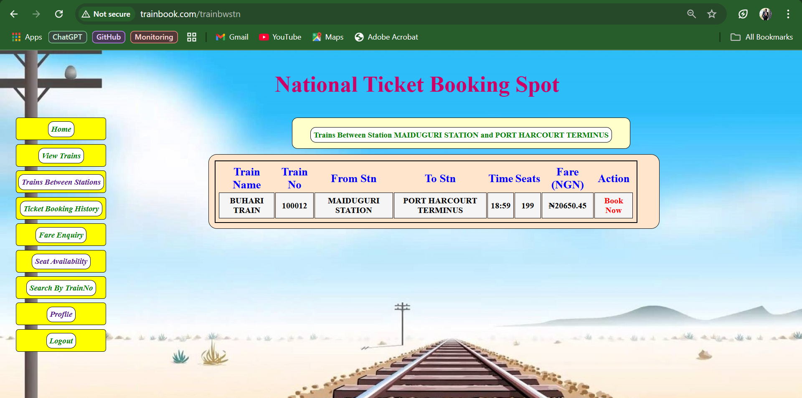

# Smart Traffic Switching: A Blue-Green Deployment Solution Using CI/CD Automation

## Table of Contents
1. [Overview](#overview)
2. [CI/CD Pipeline Features](#cicd-pipeline-features)
3. [Prerequisites](#prerequisites)
4. [Technologies Used](#technologies-used)
5. [Pipeline Details](#pipeline-details)
6. [Steps to Run the Jenkins Pipeline](#steps-to-run-the-jenkins-pipeline)
7. [Why Both Blue and Green Deployment Environment Pods Should Be Left in the Cluster](#why-both-blue-and-green-deployment-environment-pods-should-be-left-in-the-cluster)
8. [Checking the Current Environment - Blue or Green](#checking-the-current-environment---blue-or-green)
9. [Switching Traffic Manually Between Environments in the Cluster](#switching-traffic-manually-between-environments-in-the-cluster)
10. [Troubleshooting](#troubleshooting)
11. [Additional Resources](#additional-resources)
12. [Contributing](#contributing)

## Overview
### Smart Traffic Switching: A Blue-Green Deployment Overview


### Project Application Overview
The project application **Train Ticket Reservation System** is a web-based application designed to simplify the process of booking train tickets and gathering information related to train schedules, seat availability, and fare inquiries. The application allows users to register, view available trains, check seat availability, book tickets, and view booking history. Additionally, the application offers an admin interface for managing train schedules, updating train information, and handling reservations.

### Application Key Features:
- Train schedules and availability viewing.
- Secure seat booking.
- Admin management of train schedules.
- Login, logout, and profile management.
---

### Project Overview

This project implements a highly automated CI/CD pipeline using the Blue-Green deployment strategy to achieve zero-downtime deployments. The Jenkins pipeline is designed to handle every aspect of application delivery, from code integration to traffic switching, ensuring smooth and secure rollouts. Below is a detailed overview of how the pipeline ensures Smart Traffic Switching between the **Blue** and **Green** environments, along with its standout features.

#### Key Highlights:
- **Dynamic Environment Selection**: The pipeline allows users to choose the target deployment environment (Blue or Green) dynamically through parameters.
- **Traffic Switching Automation**: After successful deployment, the pipeline can switch traffic between Blue and Green environments seamlessly with no service interruptions.
- **Integrated Security Scanning**: Ensures the security of the filesystem and Docker images by incorporating Trivy scanning tools at various stages.
- **Complete Artifact Management**: All build artifacts are stored and version-controlled in Nexus, ensuring traceability and easy rollback if needed.
- **Flexible Deployment Configurations**: Kubernetes manifests are dynamically applied based on the chosen environment, minimizing manual intervention.

#### Jenkins Pipeline Stages:
1. **Git Checkout**: Fetches the latest code from the main branch of the GitHub repository.
2. **Code Compile and Test**: Compiles the Java application with Maven and runs unit tests to verify functionality.
3. **Filesystem Security Scan**: Performs filesystem vulnerability scans using Trivy to detect potential risks.
4. **SonarQube Code Analysis**: Evaluates the codebase for maintainability, reliability, and security issues.
5. **Build and Publish Artifacts**: Packages the application and uploads the artifacts to Nexus for centralized storage.
6. **Docker Image Management**: Builds Docker images tagged with environment-specific identifiers **(Blue or Green)** and pushes them to DockerHub.
7. **Docker Image Security Scan**: Scans Docker images for vulnerabilities to maintain secure deployments.
8. **Secrets and Configuration Management**: Deploys sensitive information securely using Kubernetes secrets.
9. **Service and Ingress Deployment**: Deploys Kubernetes services and ingress configurations to expose the application to users.
10. **Blue-Green Deployment**: Dynamically deploys the application to the specified environment **(Blue or Green)**.
11. **Traffic Switching**: Automates traffic routing between Blue and Green environments based on user parameters, enabling seamless user experience during updates.
12. **Deployment Verification**: Confirms that the application is running correctly by checking pods, services, and ingress configurations in the selected environment.
13. **Email Notifications**: Sends detailed email updates about the pipeline status, including deployment details and environment-specific configurations.

#### Unique Features:
- **Parameter-Driven Flexibility**: Users can specify the deployment environment, Docker image tags, and whether to switch traffic—all from the Jenkins UI.
- **Comprehensive Security Assurance**: Trivy scans at multiple levels ensure that only secure artifacts and images are deployed.
- **Seamless Rollbacks**: With both environments active, reverting to the previous stable version is straightforward.
- **Dynamic Traffic Routing**: Traffic switching is implemented using Kubernetes service selectors, ensuring fast and reliable updates.

This project demonstrates how automation, security, and robust deployment strategies can work together to deliver a modern, efficient CI/CD pipeline.

---
## Technologies Used
- **Jenkins**: For orchestrating the CI/CD pipeline.
- **Maven**: For building and testing the Java application.
- **Docker**: For containerization of the application.
- **Trivy**: For security scanning of filesystem and Docker images.
- **SonarQube**: For static code analysis.
- **Kubernetes**: For deploying and managing application pods and services.
- **Nginx**: As the ingress controller for traffic routing.
- **Nexus**: Used as an artifact repository to store and manage the application's build artifacts.

---
## Prerequisites
- AWS account for EC2 and EKS resources. Or any other cloud services (GCP, Azure, etc).
- Terraform installed for provisioning infrastructure.
- Jenkins installed in a server and configured with Docker, Trivy, Maven, and [necessary plugins](#plugins-used-in-the-jenkins-pipeline).
- SonarQube and Nexus running as Docker containers in EC2 Instances.
- Kubernetes cluster with appropriate credentials (`k8-cred`) and namespace (`webapps`).
- Distribution Management Configuration in `pom.xml` file.
     
     - Update the `pom.xml` file to add your **Nexus server public Ip** `http://<nexus-server-pulic-ip>:8081` in this section of the `pom.xml` file as shown below:
       ```bash
       <!-- Configuration to Deploy both snapshot and releases to Nexus -->
       <distributionManagement>
           <repository>
               <id>maven-releases</id>
               <name>maven-releases</name>
               <url>http://<nexus-server-pulic-ip>:8081/repository/maven-releases/</url>
           </repository>
           <snapshotRepository>
               <id>maven-snapshots</id>
               <name>maven-snapshots</name>
               <url>http://<nexus-server-pulic-ip>:8081/repository/maven-snapshots/</url>
           </snapshotRepository>
       </distributionManagement>
       ```


---

## [CI Pipeline Setup](./jenkins-pipeline)

This Jenkins pipeline is designed to automate the entire CI/CD process for deploying applications using the Blue-Green deployment strategy. Below is an overview of the key stages in the pipeline:

1. **Git Checkout**: Clones the application's source code from the specified GitHub repository.
2. **Code Compile and Test**: Compiles the application using Maven and runs unit tests to ensure code quality and functionality.
3. **Security Scanning**: Performs filesystem and Docker image vulnerability scans using Trivy to ensure a secure deployment.
4. **Static Code Analysis**: Integrates SonarQube to evaluate the codebase for quality, maintainability, and security issues.
5. **Artifact Management**: Packages the application and publishes the build artifacts to a Nexus repository for version control and management.
6. **Docker Image Management**: Builds, tags, scans, and pushes Docker images to DockerHub for containerized deployment.
7. **Kubernetes Deployment**: Deploys the application's secrets, services, ingress, and pods to the Kubernetes cluster.
8. **Blue-Green Traffic Management**: Manages traffic routing between Blue and Green environments to enable zero-downtime deployments.
9. **Deployment Verification**: Verifies that the application has been successfully deployed and is running in the specified environment.
10. **Email Notifications**: Sends detailed email updates about the build and deployment status to the configured recipients.

Each stage is designed to ensure a seamless, secure, and efficient CI/CD workflow with zero-downtime deployments.

### Plugins used in the Jenkins Pipeline:
- **Docker Pipeline**
- **Docker**
- **Eclipse Temurin Installer** (For using different versions of JDK, configured JDK 17)
- **SonarQube Scanner**
- **Config File Provider** (Needed to configure Nexus artifact repository)
- **Maven Integration**
- **Pipeline Maven Integration**
- **Kubernetes**
- **Kubernetes Credentials**
- **Kubernetes CLI**
- **Kubernetes Client API**
- **Pipeline: Stage View**
   
- **For a detailed guide on setting up the CI pipeline, refer to the `README.md` file in the [jenkins-pipeline](./jenkins-pipeline/README.md) folder**. 

---

## Steps to Run the Jenkins Pipeline

To execute the pipeline in Jenkins, follow these streamlined steps:

1. **Verify Setup and Configuration**
   - Ensure all plugins are installed, including Git, Maven, Docker, Trivy, SonarQube, and Kubernetes CLI.
   - Check that credentials (`git-cred`, `sonar-token`, `docker-cred`, `k8-cred`, `email-cred`) are configured.
     
2. **Ensure all Necessary Manifest Files are added and updated**  
   - Ensure the Kubernetes manifest files are available in the **[Manifest_Files](https://github.com/Godfrey22152/Smart-Traffic-Switching-A-Blue-Green-Deployment-Solution/tree/main/Manifest_Files)** directory of the project repository:
     - `app-deployment-blue.yaml`
     - `app-deployment-green.yaml`
     - `trainbook-secrets.yaml`
     - `trainbook-service.yaml`
     - `trainbook-ingress.yaml`

3. **Run the Pipeline**  
   - Navigate to the newly created pipeline job in Jenkins.
   - Click on **"Build with Parameters"**.
   - Set the parameters for the pipeline:
     - `DEPLOY_ENV`: Choose the deployment environment (`blue` or `green`).
     - `DOCKER_TAG`: Specify the Docker image tag to use (`blue` or `green`).
     - `SWITCH_TRAFFIC`: Toggle the traffic switch box to `true` or leave it unchecked if you don't want the traffic switched from the default `blue` environment.
   - Click **"Build"** to start the pipeline.

4. **Monitor the Pipeline Execution**  
   - View the **console output** to monitor each stage of the pipeline.
   - Confirm that each stage completes successfully.

5. **Verify Deployment**  
   - View **console build output** to verify the deployment:
     - Check that pods, services, and ingress resources in the namespace `webapps` are deployed as specified in the pipeline.
     - Confirm the traffic has been switched (if applicable).
     - If successfully deployed you should see output as shown below (For the `blue` environment):
       
       ```bash
       + kubectl get pods -l version=blue -n webapps
       NAME                                  READY   STATUS              RESTARTS   AGE
       trainbook-app-blue-556b67bb58-vg8z7   0/1     ContainerCreating   0          19s
       + kubectl get svc trainbook-service -n webapps
       NAME                TYPE        CLUSTER-IP      EXTERNAL-IP   PORT(S)   AGE
       trainbook-service   ClusterIP   10.110.140.55   <none>        80/TCP    64s
       + kubectl get ingress trinbook-ingress -n webapps
       NAME               CLASS   HOSTS           ADDRESS          PORTS   AGE
       trinbook-ingress   nginx   trainbook.com   XXXXXXXXXXXXXX   80      68s
       ```

6. **Review Notifications**
   - The pipeline sends an email with the build status. Verify that notifications are correctly set up for alerts on build status.
     
7. **Verify Pod Readiness**
   - Check that the `trainbook-app` pod in either the **blue** or **green** environments are running and ready:
   ```bash
   kubectl get pods -l version=blue -n webapps
   kubectl get pods -l version=green -n webapps
   ```
   - Ensure the `READY` column shows `1/1` and the `STATUS` is `Running` as shown below:
   
     ```bash
     NAME                                  READY   STATUS    RESTARTS     AGE
     trainbook-app-blue-556b67bb58-vg8z7   1/1     Running   0            65m  
     trainbook-app-green-67bcb8d89d-jcg2k  1/1     Running   0            30m
     ```
8. **Verify Service Configuration**
   - Confirm that the `trainbook-service` is running and exposing the application correctly:

     ```bash
     kubectl get svc trainbook-service -n webapps
     
     NAME                TYPE        CLUSTER-IP      EXTERNAL-IP   PORT(S)   AGE
     trainbook-service   ClusterIP   10.110.140.55   <none>        80/TCP    2h
     ```
     - Ensure the service type is **ClusterIP** and the port is `80/TCP`.
  
9. **Verify Ingress Configuration**
   - Check the status of the ingress resource:

     ```bash
     kubectl get ingress trinbook-ingress -n webapps
     
     NAME               CLASS   HOSTS           ADDRESS          PORTS   AGE
     trinbook-ingress   nginx   trainbook.com   XXXXXXXXXXXXXX   80      2h
     ```
     - Confirm the following:
       - The `HOSTS` column contains `trainbook.com`.
       - The `ADDRESS` column displays the correct external IP (e.g., `ae33145266d546673c0263t678cb19a31540-1815147026.us-east-1.elb.amazonaws.com`).
       - The `PORTS` column includes port `80`.

10. **Update Public DNS Records**
    - To make `trainbook.com` accessible remotely, update your public DNS records to point to the external IP of the ingress (e.g., `ae33145266d546673c0263t678cb19a31540-1815147026.us-east-1.elb.amazonaws.com`):
       1. Log in to your domain registrar's DNS management console.
       2. Add an A Record with the following details:
          - Name: `@` or `trainbook.com`
          - Type: A
          - Value: `ae33145266d546673c0263t678cb19a31540-1815147026.us-east-1.elb.amazonaws.com`

       3. Save the changes.
          > **Note:** DNS propagation may take some time (usually a few minutes to a few hours).

11. **Access the Application over the browser**
    - Once DNS is updated and firewalls are configured, test accessing the application:
       1. Open a web browser and navigate to:
          ```bash
          http://trainbook.com
          ```
       2. You should see the deployed Trainbook application.
 

---
## Why Both Blue and Green Deployment Environment Pods Should Be Left in the Cluster

Leaving both **blue** and **green** deployment environment pods in the cluster ensures a robust and flexible deployment strategy. Here's why this approach is beneficial:

1. **Seamless Rollbacks**  
   - If an issue arises with the currently active environment (e.g., blue), the green environment remains available and can be switched back quickly without redeployment. This ensures minimal downtime and faster recovery.

2. **Testing and Validation**  
   - The inactive environment (e.g., green) can be used for further testing and validation of new features or updates without impacting the live environment. This promotes a safer and more controlled deployment process.

3. **Traffic Splitting**  
   - Having both environments active allows for advanced deployment strategies like **canary deployments** or **A/B testing**, where traffic is gradually split between the blue and green environments to observe performance and user behavior.

4. **Disaster Recovery**  
   - In the event of unexpected failures, having both environments ensures that one environment remains operational, significantly reducing downtime and maintaining service availability.

5. **Simplified Deployment Workflow**  
   - Leaving both environments active eliminates the need for re-provisioning pods during every switch. This saves time and resources, especially in high-traffic applications requiring frequent updates.

6. **Consistency Across Updates**  
   - Both environments ensure that the cluster has a backup ready for use, maintaining operational consistency while changes are being applied.

By maintaining both blue and green environments in the cluster, organizations can achieve high availability, enhance deployment flexibility, and minimize risks during updates or transitions. 

---

## Checking the Current Environment - Blue or Green

To determine whether the **blue** or **green** environment is currently serving traffic, follow these steps:

- **Inspect the Service Selector**
   - The service `trainbook-service` uses a selector to determine which pods it routes traffic to. You can check the selector's value to see the currently active environment.

   Run the following command:
   ```bash
   kubectl get service trainbook-service -n webapps -o yaml
   ```
   Look for the `spec.selector` field in the output. For example:
   
   ```bash
   spec:
     selector:
       app: trainbook-app
       version: blue
   ```
   In this case, the active environment is **blue**.
   
---
## Switching Traffic manually Between Environments in the cluster. 
- **You can Switch Traffic manually in the cluster at any moment without running the pipeline**.  
  **How To Do This**:
   - Verify the service selector:
   ```bash
   kubectl get svc trainbook-service -n webapps -o yaml
   ```
   - Update the selector manually specifying the environment (`green` or `blue`):
   ```bash
   kubectl patch service trainbook-service -p '{"spec": {"selector": {"app": "trainbook-app", "version": "green"}}}' -n webapps
   ```
---
## Screenshots 

### 1. Deployed TrainBooking application Images.




### 2. Pipeline Build with Parameters Trigger


### 3. Email Notification with the Build Status


### 4. Jenkins Dashboard


### 5. Jenkins Stage view


### 6. project-credentials


### 7. SonarQube Server Personal Access token (PAT)


### 8. SonarQube Server Web View


### 9. Managed Files For Nexus Server


---
## Troubleshooting
- **Pipeline Errors**: Check the Jenkins console logs for detailed error messages.
- **Deployment Failures**: Verify Kubernetes resources and logs for troubleshooting.
- **Email Notifications**: Ensure SMTP settings are correctly configured in Jenkins.
- For a detailed guide please see **[Troubleshooting Guide](https://github.com/Godfrey22152/Smart-Traffic-Switching-A-Blue-Green-Deployment-Solution/tree/main/jenkins-pipeline#troubleshooting-guide)** 

---
## Additional Resources
- [Kubernetes Documentation](https://kubernetes.io/docs/)
- [Jenkins Plugins](https://plugins.jenkins.io/)
- [SonarQube](https://www.sonarqube.org/)
- [Trivy](https://aquasecurity.github.io/trivy/)
- [Docker](https://www.docker.com/)

---
## Contributing
Contributions are welcome! Feel free to open issues or submit pull requests.
